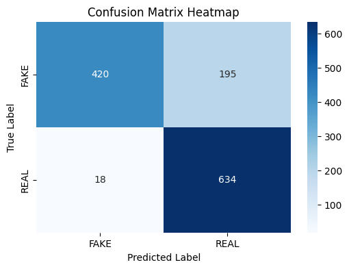

```python
import pandas as pd
import seaborn as sns
import matplotlib.pyplot as plt
from sklearn.model_selection import train_test_split
from sklearn.feature_extraction.text import TfidfVectorizer
from sklearn.naive_bayes import MultinomialNB
from sklearn.metrics import accuracy_score, classification_report, confusion_matrix
df = pd.read_csv('Data_fake_or_real_news.csv')
df
```


<div>
<style scoped>
    .dataframe tbody tr th:only-of-type {
        vertical-align: middle;
    }

    .dataframe tbody tr th {
        vertical-align: top;
    }

    .dataframe thead th {
        text-align: right;
    }
</style>
<table border="1" class="dataframe">
  <thead>
    <tr style="text-align: right;">
      <th></th>
      <th>id</th>
      <th>title</th>
      <th>text</th>
      <th>label</th>
    </tr>
  </thead>
  <tbody>
    <tr>
      <th>0</th>
      <td>8476</td>
      <td>You Can Smell Hillary’s Fear</td>
      <td>Daniel Greenfield, a Shillman Journalism Fello...</td>
      <td>FAKE</td>
    </tr>
    <tr>
      <th>1</th>
      <td>10294</td>
      <td>Watch The Exact Moment Paul Ryan Committed Pol...</td>
      <td>Google Pinterest Digg Linkedin Reddit Stumbleu...</td>
      <td>FAKE</td>
    </tr>
    <tr>
      <th>2</th>
      <td>3608</td>
      <td>Kerry to go to Paris in gesture of sympathy</td>
      <td>U.S. Secretary of State John F. Kerry said Mon...</td>
      <td>REAL</td>
    </tr>
    <tr>
      <th>3</th>
      <td>10142</td>
      <td>Bernie supporters on Twitter erupt in anger ag...</td>
      <td>— Kaydee King (@KaydeeKing) November 9, 2016 T...</td>
      <td>FAKE</td>
    </tr>
    <tr>
      <th>4</th>
      <td>875</td>
      <td>The Battle of New York: Why This Primary Matters</td>
      <td>It's primary day in New York and front-runners...</td>
      <td>REAL</td>
    </tr>
    <tr>
      <th>...</th>
      <td>...</td>
      <td>...</td>
      <td>...</td>
      <td>...</td>
    </tr>
    <tr>
      <th>6330</th>
      <td>4490</td>
      <td>State Department says it can't find emails fro...</td>
      <td>The State Department told the Republican Natio...</td>
      <td>REAL</td>
    </tr>
    <tr>
      <th>6331</th>
      <td>8062</td>
      <td>The ‘P’ in PBS Should Stand for ‘Plutocratic’ ...</td>
      <td>The ‘P’ in PBS Should Stand for ‘Plutocratic’ ...</td>
      <td>FAKE</td>
    </tr>
    <tr>
      <th>6332</th>
      <td>8622</td>
      <td>Anti-Trump Protesters Are Tools of the Oligarc...</td>
      <td>Anti-Trump Protesters Are Tools of the Oligar...</td>
      <td>FAKE</td>
    </tr>
    <tr>
      <th>6333</th>
      <td>4021</td>
      <td>In Ethiopia, Obama seeks progress on peace, se...</td>
      <td>ADDIS ABABA, Ethiopia —President Obama convene...</td>
      <td>REAL</td>
    </tr>
    <tr>
      <th>6334</th>
      <td>4330</td>
      <td>Jeb Bush Is Suddenly Attacking Trump. Here's W...</td>
      <td>Jeb Bush Is Suddenly Attacking Trump. Here's W...</td>
      <td>REAL</td>
    </tr>
  </tbody>
</table>
<p>6335 rows × 4 columns</p>
</div>


```python

```

I am considering the text column as features as most often the text is what actually matters for deciding if it is fake or not 


```python
X = df['text']
y = df['label'] 
```


```python
# Train Test splitting

X_train, X_test, y_train, y_test = train_test_split(X, y, test_size=0.2, random_state= 0)

```


```python
# vectorizing the text

# I have considered max_df=0.7 that means ignoring words that are appering 70% or more beacuase words like this, is, are etc. does not help finding 
# authenticity of the news. As it is a hyper parameter, I am considering 0.7 accroding my knowledge
vectorizer = TfidfVectorizer(stop_words='english', max_df=0.7)
X_train_tfidf = vectorizer.fit_transform(X_train)
X_test_tfidf = vectorizer.transform(X_test)


```


```python
# Training the Naive Bayes classsifier
model = MultinomialNB()
model.fit(X_train_tfidf, y_train)
```
```python
# Prediction and evalution
y_pred = model.predict(X_test_tfidf)

print("Accuracy:", accuracy_score(y_test, y_pred))
print(classification_report(y_test, y_pred))
```

    Accuracy: 0.8318863456985004
                  precision    recall  f1-score   support
    
            FAKE       0.96      0.68      0.80       615
            REAL       0.76      0.97      0.86       652
    
        accuracy                           0.83      1267
       macro avg       0.86      0.83      0.83      1267
    weighted avg       0.86      0.83      0.83      1267
    
    


```python

# Confusion Matrix
cm = confusion_matrix(y_test, y_pred)

# Plot as heatmap
plt.figure(figsize=(6,4))
sns.heatmap(cm, annot=True, fmt="d", cmap="Blues", xticklabels=model.classes_, yticklabels=model.classes_)
plt.xlabel("Predicted Label")
plt.ylabel("True Label")
plt.title("Confusion Matrix Heatmap")
plt.show()
```


    

    


The confusion matrix shows that the classifier precited 195 of the fake news as real and 18 of the real news as fake. Although the classifier showed good performance by obtaining the  is 83%, the classifier tends mis classify fake news more. This may be caused by several resons like the dataset may contain 
fake news sanmple less than the real news, or may the random_state or value of max_df casusing this behavior. So, efficient adjustment of those hyper parameters may lead to a more better performance.


```python

```
